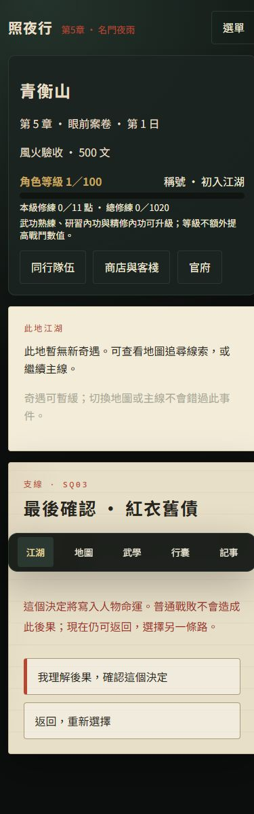
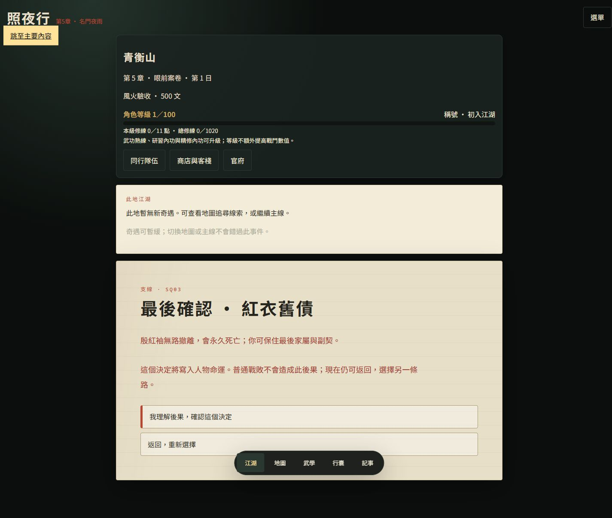

# 《照夜行》主線重寫與十二條支線驗收

驗收日期：2026-09-30。遊戲版本 0.5.1，故事修訂 2，存檔格式 4。本次內容已納入單人遊戲；原機械匯入稿 `src/data/zhaoye-script.js` 保留。

## 內容與流程

八章名稱、主要交鋒與政治結局保留，序章及 37 個主場景換用作者正文。顧長纓透過真實的舊救援網引導調查、集中證人與材料；青衡揭開收網，承京再核對裴把「留」改成「除」的命令。前段只展示憑證日期、接應記號、證人去向與預備名冊等可疑現象。終局回收湯碗、斷旗、空鞍、新鞋與家信。

獨立支線控制器保存階段、交鋒、操作、選擇、確認與結果，不變更主線游標。每條完成發放一次 100 文、50 修為，情報仍須主線獨立核驗。記事只顯示已經完成相應交鋒的線索；任務接取與下一步也出現在江湖與地圖。

| 任務 | 開放／續接 | 分支與後續回應 |
|---|---|---|
| 湯涼之前 | 一 | 杜成親送／柳青接手；七章接應 |
| 缺角鏢旗 | 一→五 | 另立鏢路／葉永久離隊；終戰鏢牌或程野接應 |
| 紅衣舊債 | 二→五 | 交證受審／殷永久死亡；終局林嫂交證 |
| 鹽牢餘燼 | 二 | 返鄉／庇護所；六章工坊見聞 |
| 空鞍歸人 | 三→七 | 共同修橋／阿史那衡永久死亡；終局空鞍與阿拓去向 |
| 雪夜糧車 | 三 | 共同護送／分路安置；七章軍戶與糧車 |
| 第十九雙新鞋 | 四→八 | 分批撤離／蘇永久死亡；終局新鞋與醫工 |
| 沉燈追舟 | 四 | 船工返鄉／留下辨認；七章接應船 |
| 無聲借命 | 五 | 受保護作證／匿名離開；八章弩陣線索 |
| 封條背面 | 六 | 公開補救／沈永久離隊；終局封條去向 |
| 不寄的家書 | 七 | 送信人回家／自願續送；終局回信或家屬接人 |
| 天明最後一鏢 | 八 | 直接返鄉／自願辨認；後日談最後一趟鏢 |

八條短篇為三段、一戰；四條跨章為五段、兩戰。未接或未完成任務於期限結算為當地接手，不給獎勵、不冒認功勞、不造成同伴死亡。已完成第一段的中篇保留到後章。普通支線戰敗或未完成救援操作皆可重試。

三位死亡與兩位離隊只由完成的劇情選擇觸發。選項標明永久後果，正文展示撤離條件與保全替代方案，另有可取消的獨立確認頁。人物移出隊伍且禁止重招；後續個人場景改為舊信／封條記事，必要接應由程野、方璧、林嫂、烏祁與鄭雨承擔。

## 存檔與離線

本機載入、繼續與備份匯入均拒絕舊格式或舊故事修訂，要求重新創角。新槽使用 `v2_auto_*`、`v2_manual_*` 與獨立的上次旅程鍵。測試確認舊快照與世界未遭刪除，新版匯出僅收新版世界及其角色。戰鬥快照保留任務／遭遇 ID、回合、資源、RNG 與救援操作，缺失或不匹配的支線快照拒絕載入。

Service Worker 已納入作者正文、支線資料、控制器、命運與介面模組，並更新快取版本；靜態依賴完整性測試通過。

## 驗證結果

- `node --test --test-isolation=none`：182 項通過。涵蓋全部 24 個支線結局、全部 16 個遭遇的存讀、戰敗重試、確認取消、防重複結算／獎勵、跨章續接、略過與人物命運。
- 整體故事逐步序列化驗證：全略過支線、十二條全部保全、三位死亡加兩位離隊，都能完成八章。既有主線測試另涵蓋貧困、可選事件略過、多種主選項及所有主戰敗退後補救。
- `node scripts/validate-content.mjs` 通過；十二支線、四跨章、場景／地點／後續回應引用與永久後果提示均有效。未參與者不會出現支線謝辭，支線材料不直接將 E1–E4 改為已核實。
- `node scripts/zhaoye-balance-audit.mjs`：28,800 場，十場主線、十八起始武功、一至四人隊伍、每組四十種子；通過原有勝率與差距門檻。
- `node scripts/sidequest-balance-audit.mjs`：46,080 場，十六新增交鋒；救援佔用實際回合，不另加裝備或任務強化。各配置成功率 100%，通過門檻。此為可完成性稽核，並非難度滿意度評估。
- 瀏覽器實際新創角、赴鴉渡、接取《湯涼之前》、執行救援、交鋒中重整、續戰、選擇養傷、確認 100 文獎勵及主線游標未變。重整恢復第 2 回合，氣血與救援 1／1 保留。
- 瀏覽器匯入新版驗收備份後，走查《紅衣舊債》保全替代方案、死亡選項、確認頁存讀、取消返回、鍵盤確認；殷紅袖從同行隊伍移除且無招募入口。舊版有效校驗備份顯示重新創角提示。
- 390×844 與 1440×1000 實際走查：閱讀、五個導覽入口、記事、Enter 操作、風險提示皆可使用，根文件無橫向溢出。截圖見下方。瀏覽器人工操作採代表任務；十二條所有分支覆蓋由自動測試完成。

## 可重現資料與畫面

作者稿：[新版主線與十二支線作者稿](照夜行_新版主線與十二支線作者稿.md)。執行 `node scripts/export-narrative.mjs` 可由作者資料重新輸出。

`node scripts/narrative-ui-fixtures.mjs` 產生專用風險確認與舊格式備份，供本機 UI 驗收；這些不是玩家正式進度。

本次保留工作區既有未提交修改，未提交或部署。原驗收文件記錄的舊存檔相容政策已由本版重新開局政策取代。
